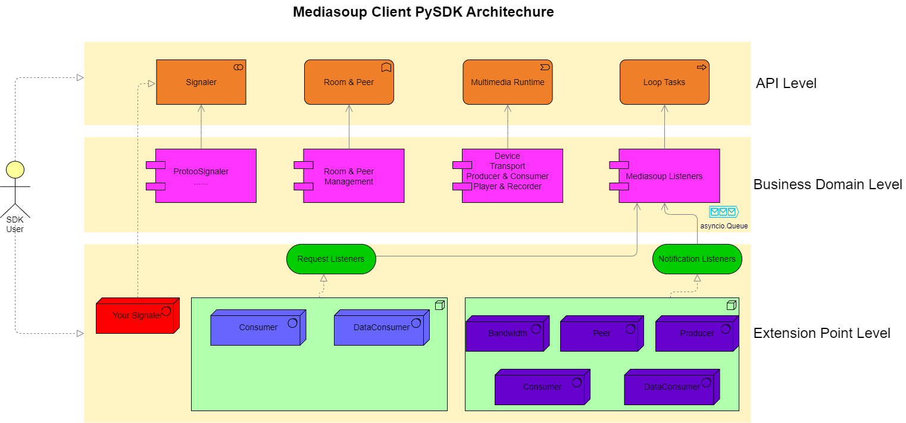

# Mediasoup-Client-PySDK (aka "smcdk")
a simple-to-use, pure python sdk of [mediasoup](https://mediasoup.org/) client, fork from [pymediasoup](https://github.com/skymaze/pymediasoup) and do more.

## Install
```bash
pip3 install smcdk
```

Note:

1. on Linux && MacOS, please ensure that libopus's and libvpx's development files have been installed
   before doing the above pip install, because there is a building step after installing the dependent aiortc lib.
   e.g.
   On Ubuntu：
```bash
sudo apt install libopus-dev, libvpx-dev
```

2. in order to run examples/sdkApiDemo.py with mediasoup-demo/server's protoo websocket sub-protocol at  GitHub, the websockets lib is also required:
```bash
pip3 install websockets
```

## Usage
For the purpose of to be an easy-to-use SDK, smcdk API design focus mainly on high level, and for users who know little about the official mediasoup client API. 

```python
from smcdk import *
# customize your own signaler, request and notification listeners by passing parameters or use default
mediasoup_client = MediasoupClient(...)
# provide room & peer info, together with producer & consumer config  
mediasoup_client.joinRoom(...)
# start producing if the autoProduce of the producer config is set to false
mediasoup_client.play(...)
# please invoke the close method before stop the client
mediasoup_client.close()
```
more details, please see: examples/sdkApiDemo.py at GitHub

## Why another mediasoup-client?( My Personal Option, for reference only)
There are several official and unofficial client implementations, but they are not quick and easy to run on all OS's desktop, so are not suitable to be a general SDK: 
1. official client with corresponding dependency lib
- mediasoup-demo/aiortc: because it is based on Unix Socket, so it can't run in Windows
- mediasoup-demo/broadcasters: it is based on bash language, which is good at integrating command line tools, but is not good at developing new features
- mediasoup-demo/app: it can only run in browsers, and Electron-like desktop environment with less disk space occupation, or run in Node.js with more space occupation because of the node_modules directory
- mediasoup-broadcast-demo: it's quite hard to compile and link a libwebrtc dependency successfully on all OS platform, especially in China mainland's network environment

2. no-official client
- pymediasoup： it is quite nice, but its API is a little hard to quick start as SDK

## Architecture & Design


### Mediasoup Client
it contains:
- Mediasoup Signaler Interface: follow the semantics of mediasoup-demo/server
- Loop Tasks & Listeners: to tackle signaler request and notification from server side
- Room and Peer: a group of simple room information related APIs to be integrated to Listeners
- Multimedia Runtime: a stateful mediasoup Device

### Business Domain Based Listener Design
There are several business domain in SDK design:
Bandwidth, Peer, Producer, Consumer, DataConsumer, result in 2 request listeners
and 5 notification listeners, which their Respective interesting events to listen and tackle
1. Server Request
- Consumer Listener event: newConsumer
- DataConsumer Listener event: newDataConsumer
2. Server Notification
- Bandwidth Listener event: downlinkBwe
- Peer Listener event: newPeer, peerClosed, peerDisplayNameChanged, activeSpeaker
- Producer Listener event: producerScore
- Consumer Listener event: consumerLayersChanged, consumerScore, consumerClosed, consumerPaused, consumerResumed
- DataConsumer Listener event: dataConsumerClosed

## Features
To be an easy-to-use sdk for mediasoup client development, smcdk is
- **1.friendly to both beginners and veterans**

With smcdk's high level API, beginners can integrate it into their own app quite conveniently without the need to understand mediasoup's concept such as Device, Router, Transport, Producer, Consumer;
Besides, smcdk also provide low level API, such as the Device, AiortcHandler, for veterans to conduct in-depth customization.

- **2.quick to run**

As mentioned above, it's easy to build without the libwebrtc dependency
 
- **3.all os(Windows, Linux, macOS) platform friendly**

As mentioned above, Without the implementation based on Unix Socket, smcdk is cross-platform.
I've tested on Windows 10, Ubuntu 22.04 LTS and NacOS Catalina.

- **4.signaling pluggable**: 

Based on the mediasoup's design goal of "signaling agnostic", 
>Be signaling agnostic: do not mandate any signaling protocol.”

(sited from [mediasoup :: Overview](https://mediasoup.org/documentation/overview/)). 
smcdk provide an out-of-box ProtooSignaler furthermore. 
Besides the default built-in signaler, which is used to communicate with mediasoup-demo/server, 
you can provide your own MediasoupSignalerInterface implementation to meet your requirement.

- **5.listener customizable**

Currently, you can customize 2 request listeners and 5 notification listeners 

## About Code Style
  You can see many Camel-Case-Style naming in my Python code, 
e.g. "getRouterRtpCapabilities", not "get_router_rtp_capabilities".
  The reason is not only that I began my career as a Java developer since 2008,
but also that I hope this SDK can be applied by those developers who use Python as a no-major language, 
and developers who have learned mediasoup by its demo app & server.
  Maybe sometime in the future, I'll change this naming style to follow Python’s PEP8 rules.

## LICENSE
MIT

## Thanks
special thanks to [pymediasoup](https://github.com/skymaze/pymediasoup), [mediasoup](https://mediasoup.org/), and [aiortc](https://github.com/aiortc/aiortc) projects, they lay a solid foundation for the birth of smcdk.
